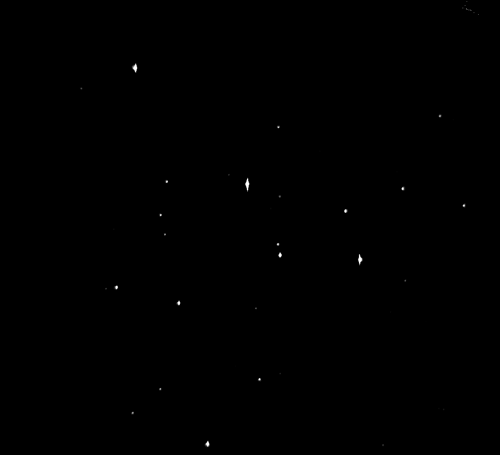
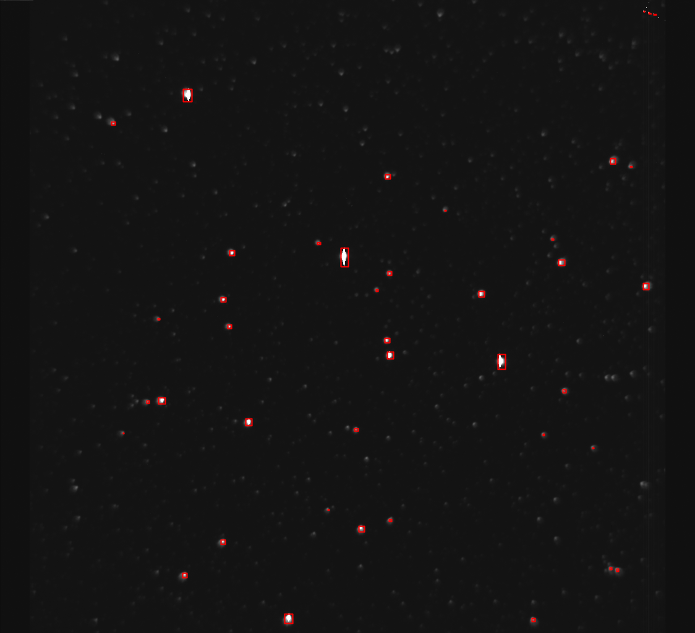
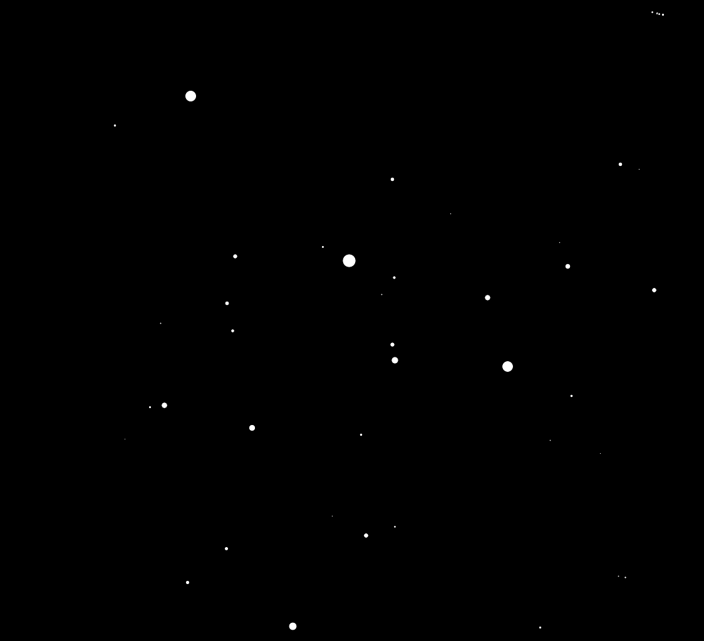

## Unecessary homework

Encountered someone else's homework question that took my fancy.  
Basicly given a text list with three columns representing (x,y)=z   
which is said to be a telescopic image of some starfield.  
The goal is to: 
*    Say how many stars there are,   
*    where the stars are in the image,   
*    give relative brightness of the stars.    

This is clearly an image processing problem and there are 
astronomy specific packages available to solve it.  

But that is not interesting unless it is your profession.

So a new version __ipython__ (now jupyter) was just released   
and I see it has a __bash__ kernel  
Lets see how far we get treating this as a data munging problem in the shell 
instead of an image processing problem.
 
One advantage to this approach is it's methods are somewhat independent   
of the dimension of the problem, that is, although we could make an image and look at it,  
not relying on our visual cortext is good practice for working on a problem where   
falling back to pointing and grunting is not an option.

Our data set is a field, a representation of intensity at a location two dimensions.

    # wget  http://homework.uoregon.edu/pub/class/sciprog15/stars.txt

    

* Step one is allways look at the file

    head stars.txt

    1. 1.  1028.
    2. 1.  1335.
    3. 1.  1375.
    4. 1.  1361.
    5. 1.  1310.
    6. 1.  1332.
    7. 1.  1994.
    8. 1.  2116.
    9. 1.  1949.
    10. 1.  1867.

###Clean
see if the decimal points are ever significant

    grep "\.[0-9]" stars.txt

    

nope. never significant

remove cruft -- decimal point, extra spaces, convert spaces to tabs

    tr -d \. < stars.txt | tr -s ' ' | tr ' ' '\t'  > stars.tab

check that what remains are well formed integers

    grep -v "^[0-9]*.[0-9]*.[0-9]*$" stars.tab

yep. all whole numbers. 

###Explore

Get the width and height.
They will be the largest values (locations) in the first two columns.

    X=$(cut -f1 stars.tab | sort -n | tail -n1)
    Y=$(cut -f2 stars.tab | sort -n | tail -n1)
    echo $X $Y

How many distinct indensity values in the this column?

    cut -f3 stars.tab | sort -n | uniq -c | wc -l

what are the min and max indensity?

    IMIN=$(cut -f3 stars.tab | sort -n | head -n1)
    echo ${IMIN}

    IMAX=$(cut -f3 stars.tab | sort -nr | head -n1)
    echo ${IMAX}

    echo "2^16-1" | bc

That max intensity value represents a saturation of the sensor.  
The data for those pixels (and those it overflowed into), will be ...  
suboptimal.

### Adjust

It will not change our relative measurements to reduce all intensities by $IMIN  
and it will provide a bit of headroom below 2^16 and a base of zero.

    awk -v OFS="\t" -v "IMIN=${IMIN}" '{$3-=IMIN;print}' stars.tab > stars_0.tab
    IMIN=$(cut -f3 stars_0.tab | sort -n | head -n1)
    
    echo ${IMIN} 

    IMAX=$(cut -f3 stars_0.tab | sort -nr| head -n1)
    
    echo ${IMAX}

###Measure more

what is the average intensity?

    awk '{a+=$3}END{print a/NR}' stars_0.tab

Note: Since background plus stars averages to about 257 the actual background must be below this value.  

    echo "scale=3;257/65272*100" | bc

Avgrage intensity is less than a third of one percent of the brightest.  
Or the bright ones are around 300 times the average

From a more CS big-O perspective 2^8 goes into 2^16   
2^8 times so the bright point(s) are the overall average squared.

### Histogram

Generate a histogram, remember there were 5,146 distinct intensities.  
This histogram is the the number of pixels of an intensity, ordered by intensity.   

Expect to start with many shades of dark gray and a spike of bright towards the end.

    cut -f3 stars_0.tab | sort -n | uniq -c | \
    sed 's| *\([0-9]*\) *\([0-9]*\)|\1\t\2|g' > stars.hist
    
    head  stars.hist

    tail stars.hist

Nothing too exciting at the extremes except 
the hundreds of saturated pixels.  
What are the mose common values (expect background)

    sort -nr stars.hist | head

the most common intensities are below 200 
which agrees well with background needing to be below the average (256.9)  

Histograms are best seen.  
We could write a simple script to print something.  
But gnuplot is ancient, flexible, widely available and very good to be aware of. 

    gnuplot << END
    set xrange [0:65272];
    set yrange[0:30890];
    set terminal dumb;
    plot 'stars.hist' using 2:1;
    END

Effectvily no interesting structure at this resolution, 
a spike near x=0 and y is close to zero elsewhere.

Try taking the log of the counts of intensities

    gnuplot << END
    set xrange [0:65272];
    set yrange[0:12];
    set terminal dumb;
    plot "<awk '{print \$2,log(\$1)}' stars.hist" ;
    END

That shows exponential decay-like structure with a blip at the end
which could agree with a bunch of background a then some stars story.

Next find an intensity threshold between the stars and background 
by partitioning intensities to minimize variation 
within the brighter and the darker sets of pixels.
That is, pick a number so that all the values on either side have more in common with each other than values on the other side.

Note:  
Choosing a threshold that minimizes variation within the stars(bright)   
AND the dark (background) is mathematicaly the same as maximizing the variation between the two. 

This <a href="http://localhost:8888/edit/otsu.awk">otsu.awk</a> script is named after the algorithm's author
offers a threshold value on which to split the histogram.

    #./otsu.awk stars.hist
    
    CUT=$(./otsu.awk stars.hist)
    echo ${CUT}

According to this metric, the background pixels are those in about the first 1/8th of the histogram.  

What does this say?  

First lets eliminate what it does not say.  
It does not say that 7/8 of the intensities we have are stars.    
It does not even say the background pixels are the area under the curve of first 1/8 of the histogram.  

The histogram's max value is over 65 thousand, but we only have about 5 thousand different intensities in the dataset. It is possible there are evenly spaced so there is a bin of intensities every ~31 apart but that is highly unlikely.   

So how many bins of intensites fall on ether side of our threshold?  

    awk -v"CUT=${CUT}" 'CUT<$2{hi++}CUT>=$2{lo++}END{print "background " lo " bins\tforeground " hi " bins"}' stars.hist

    echo "scale=3;3884/8160" | bc

Although the background pixles fall within the first eighth of the spread, they account for three quarters of the diversity over the spread. Which means when we zero out the background we will also be eliminating the majority of something, hopfully mostly noise.

So what we can say is most of the varitey is in the background which fall into the first eigth of the spread where nearly every other (2nd) intensity is represented in the data .

    echo "scale=3;1262/(65272-8160)" | bc

 And there is less varitey in the intensity of the stars where only one in 50 or so possible intensities are represented in the data. Which allows the background to have ~25 times the coverage on the histogram than the stars do.   I will have to think about what this implies. 

What are the average intensities on either side of this threashold?

    awk -v"CUT=${CUT}" 'CUT<$3{mean+=$3;count++}END{print int(mean/count+.5)}' stars_0.tab 

    awk -v"CUT=${CUT}" 'CUT>=$3{mean+=$3;count++}END{print int(mean/count+.5)}' stars_0.tab 

The intensities are now described as so:  
 
* BG mininum       0
* BG average     203
* BG maximun   8,160   
*    threshold    
* FG mininum   8,161
* FG average  34,475
* FG maximum  65,272

That is a very non linear jump from BG average to the BG max something like 40:1.  
In contrast the FG average  to FG max is closer to 2:1.

With that large a step there is apt to be some information being lost as background,  
but we have to start somewhere and in this case I think we can be sure  
remaining foreground pixels are in fact __NOT__ background.   

So, without losing _reliable_ information 
we can zero out all intensities below the threshold  
and we can shift remaining pixels down in intensity  
by the amount od the background average.  

We can think of subtacting the BG avg from everything as reducing sky glow

    AVGBG=$(awk -v"CUT=${CUT}" 'CUT>=$3{mean+=$3;count++}END{print int(mean/count+.5)}' stars_0.tab)
    echo ${AVGBG}

### Check
How does that sky reduction change BG avg and does it meaningfully effect the choice of threshold?

The new threshold is:

    awk -v"AVGBG=${AVGBG}" -vOFS="\t" '$3<=AVGBG{$3=0;print}$3>AVGBG{$3-=AVGBG;print}' stars_0.tab >stars_1.tab

    # cut -f3 stars_1.tab | sort -n | uniq -c | ./otsu.awk
    CUT=$(cut -f3 stars_1.tab | sort -n | uniq -c | ./otsu.awk)
    echo ${CUT}

The new BG avg is:

    awk -v"CUT=${CUT}" 'CUT>=$3{mean+=$3;count++}END{print int(mean/count+.5)}' stars_1.tab

    echo "203+$CUT" | bc

The threshold effectivly did not move while the average background faded almost 90%.  

This is encourageing.

### Isolate stars

Isolate the signal (stars) by lowering all intensities by the threshold [clipped to zero]

    awk -F '\t' -v"CUT=${CUT}" -vOFS="\t" '{$3=($3<CUT)?0:$3-CUT; print}' < stars_1.tab > stars_thresh.tab

Check the maximum remaining intensity

    IMAXT=$(cut -f3 stars_thresh.tab | sort -n| tail -n1)
    echo ${IMAXT}

 How many different  star intensity levels do we have left?  (previously 5,146)

    cut -f3 stars_thresh.tab | sort -u | wc -l

We lost ~3/4 of the variation in intensities we had zeroing out the background.   
This reinforces there may be sturcture in the background we are missing.

### Focus on the stars
How many non-background pixels are there?

Make a new list of just the stars to play with (a sparse martix) 

    awk '$3!=0 {print}' stars_thresh.tab > stars_sparse.tab
    wc -l stars_sparse.tab

This shows that about 2/3 of the non-background values are unique!  
That seem high to me.

Are the duplicate intensities evenly distributed   
or clustered, skewed to the high or low end?

    cut -f3 stars_sparse.tab | sort -n | uniq -c | sort -nr | head

That is definitive. 
The saturated pixels are responsible for duplicate values.

### star only histogram

Still want to see a histogram of just the bright pixels  
Should get one of just the background as well.  
If there is still some structure we could go looking for faint stars (phase two).

Double check the brightest for ploting

    cut -f3 stars_sparse.tab | sort -n | uniq -c | \
        sed 's| *\([0-9]*\) *\([0-9]*\)|\1\t\2|g' > stars_sparse.hist
    cut -f2 stars_sparse.hist | sort -n | tail -n1

    gnuplot << END
    set xrange [0:57112];
    set yrange[0:3];
    set terminal dumb;
    plot "<awk '{print \$2,log(\$1)}' stars_sparse.hist" ;
    END

I am a bit concerned about the dip in the middle.  
the nice peak at the end will be stars ... has to be.

But that elevated plateau early on that just falls off does not agree with  
what I would expect from a bunch of stars (bright cores surounded by a diminishing halo)

maybe split it again... stars from halo-glare or something so we just see a
single peak distribution.

Or maybe it is different populations of stars  some close, some far.  
best to just follow through for now. 

The bright star list should be sorted by Y and then X by construction but double check. 

    sort -c -k2 -k1 -n stars_sparse.hist

sort is as expected.

### clean stars

From general background domain knowlage 
I know cameras sometimes have "hot pixels"  
and that sometimes cosmic rays hit a sensor causing it to saturate. 

Neither of these are stars so if an isolated pixel is saturated,   
it is most likely an error and we should consider removing it.

We can make a filter called RIP "Remove Isolated Pixels"  
then specialize it to only filter hot pixels for a given value of hot.    
<a href="/edit/xyzriph_sparse.awk ">xyzriph_sparse.awk</a>

    ./xyzriph_sparse.awk -v"HOT=${IMAXT}" stars_sparse.tab  | wc -l

    wc -l stars_sparse.tab

One hot pixel using a 9-point stencil.

Check for any isolated pixeles (they represent discontinuitues and are suspect) 

    ./xyzriph_sparse.awk stars_sparse.tab  | wc -l

about half dozen of any intensity  

Isolate them and have a look.  

Note: awk associative arrays are not inherently sorted so sort them externaly 

    ./xyzriph_sparse.awk stars_sparse.tab | sort -k2n -k1n > stars_rip.tab
    
    diff stars_sparse.tab stars_rip.tab| grep "^<"

It is suspicious that these isolated pixels are all up in the same (upper right) corner 
but the universe is a big place for things happen in.

It is also suspicious the first 6 are all about the same brightness and somewhat linear  
A satellite or plane maybe? 

Well they are gone bye-bye now.

### cluster
It would be nice if all these these bright pixels were split into their own clusters...

Simple flood filling is an easy way to find adjecent pixels.  
Pick any non-clustered pixel repeatedly find all adjecent pixels till there are no more  
and call it a cluster, rinse and repeat.

This awk script rearrages the sparse matrix so pixels in a cluster are  
adjecent and there is an empty line between clusters.

    awk '\
    function flood(x,y){ \
        step=x   SUBSEP y-1;if(step in a){print a[step];delete a[step];flood(x,y-1)}\
        step=x   SUBSEP y+1;if(step in a){print a[step];delete a[step];flood(x,y+1)}\
        step=x-1 SUBSEP y;  if(step in a){print a[step];delete a[step];flood(x-1,y)}\
        step=x+1 SUBSEP y;  if(step in a){print a[step];delete a[step];flood(x+1,y)}\
        step=x-1 SUBSEP y-1;if(step in a){print a[step];delete a[step];flood(x-1,y-1)}\
        step=x-1 SUBSEP y+1;if(step in a){print a[step];delete a[step];flood(x-1,y+1)}\
        step=x-1 SUBSEP y-1;if(step in a){print a[step];delete a[step];flood(x+1,y-1)}\
        step=x+1 SUBSEP y+1;if(step in a){print a[step];delete a[step];flood(x+1,y+1)}\
    }\
    {a[$1,$2]=$0}\
    END{ while(length(a)>0){\
            for(seed in a){if(seed in a)break}\
            split(seed,xy,SUBSEP);\
            print a[seed];\
            delete a[seed];\
            flood(xy[1],xy[2]);\
            print ""\
        }\
    }' stars_rip.tab > stars_clust.tab

    grep -c "^$"  stars_clust.tab

That is promising.

### Generate cluster statistics

Get some per cluster averages.

    awk -vOFS="\t" 'BEGIN{xw=yw=xa=ya=x=y=z=count=0; xi=yi=9999999}\
        !/^$/ {count++; x+=$1; y+=$2; z+=$3;    # sums \
                xw+=log($1)*$3; yw+=log($2)*$3; # Weighted sum\
                xi=xi<$1?xi:$1; xa=xa>$1?xa:$1; # X min max\
                ya=ya>$2?ya:$2; yi=yi<$2?yi:$2; # Y min max\
        }\
        /^$/ {print int(exp(xw/z)+.5),int(exp(yw/z)+.5), #weighted mean\
                #int(x/count+.5),int(y/count+.5), # arth mean \
                int((17-log(z))*100)/100,       # Pseudo Magnitude\
                int(sqrt(count*3.14)+.5),       # Pseudo Radius\
                xi, xa, yi, ya,                 # bounding box\
                count;                          # pixels in the custer\
                xw=yw=xa=ya=x=y=z=count=0; xi=yi=9999999\
        }' stars_clust.tab | sort -k3,3n > cluster_digest.tab

 ### View cluster statistics
 
 X,   Y,     Mag,    rad,   xmin,   xmax,    ymin,  ymax,   count

    cat cluster_digest.tab

    X,   Y,     Mag,    rad,   xmin,   xmax,    ymin,  ymax,   count

- First two columns are weighted centroids (arithmetic centers are within 1)
- The third is the log of sum of intensities in the cluster (approximate magnitude)
- The fourth column is an aproximate radius. (circle with area ~ number of pixels)
- The 5th,6th, 7th & 8th cols are limits of cluster
- Last is number of pixels in the cluster

### Check cluster symetery

Although the bounding box will be useful if we ever make an image  
it is a pain to gleen information from at a glance,  
and I want to see how square the bounding boxes are.

    awk '{print ++i")","",$6-$5, $8-$7}' cluster_digest.tab 

The first three (brightest) are all atleast twice as high as they are wide (probably saturated blooming in columns)      
A couple that are a single pixel wide are questionable.  

The majority are relativly square.  

## Results
At this point we can give some first aproximation of answers

    cowsay "There are at least 42 star clusters ... We know their subpixel coordinates ... We have their relative brightness."

####Observation:
To get this far, we did not need to see the image, or require specialized software,    
only standard tools that have been part of every UNIX(tm) installation for decades.

We now have a choice of focusing on cheese or holes.   

__Holes__     
Do any clusters represent multiple stars?  
Are we missing stars or have too many?

__Cheese__  
We can generate an image with our cluster statistics and see.

mmmm cheese.

### eyecandy

Re Write the original data out in the  
Net Portable Bit Map (NetPBM) format for grayscale images.

    X=$(cut -f1 stars.tab | sort -n | tail -n1)
    Y=$(cut -f2 stars.tab | sort -n | tail -n1)
    
    IMAX=$(cut -f3 stars.tab | sort -n | tail -n1)
    echo -e "P2\n${X} ${Y}\n${IMAX}\n" > stars_raw.pgm
    cut -f3 stars.tab >> stars_raw.pgm
    
    IMAX=$(cut -f3 stars_thresh.tab | sort -n | tail -n1)
    echo -e "P2\n${X} ${Y}\n${IMAX}\n" > stars_thresh.pgm
    cut -f3 stars_thresh.tab >> stars_thresh.pgm
    
    # Few image display programs understand the old braindead image formats (pbm,pgm) 
    # So we must convert it to something shinney like portable net graphics (png)  
    # so we can include it here  
    
    # Delibertly using NetPBM's "pnmtopng" to change the format.
    pnmtopng stars_raw.pgm > stars_raw.png
    pnmtopng stars_thresh.pgm > stars_thresh.png

We can see the three brightest stars are at least twice as tall as they are wide just as their cluster reported  
the solid bars of white are CCD well in a column overflowing.

If you look at the upper right corner of the image you will notice  
the distinct set of isolated pixels which look artificial  
and are not at all consistent with the rest of the image.

Also notice how all the comma (flair) points away from the center of the image,  
that is spherical abberation in the optics (not that it is relevent in this case).

### Thesholding

While we are looking at pictures we might as well see what the thresholding did.

<table>
    <tr>
        <th>Raw image</th><th>Threshold image</th>
    </tr>
    <tr>
        <td></td>
        <td></td>
    </tr>
</table>

If I look very carefully I can spot about a dozen faint stars in the original which are not in the thersholded image.

### Rant

Here is a fun factoid, when you use poplar image processing tools on scientific data 
they may silently  ummmm err ... "enhance" your results.

    convert stars_raw.pgm stars_raw_IM.png

<table>
    <tr>
        <th>NetPBM conversion</th> <th>Image Magik conversion</th>
    </tr>
    <tr>
        <td></td>
        <td></td>
    </tr>
</table>

Here, the ImageMagik format conversion process has chosen to streach the histogram  
for us so we can make out hundreds of faint stars.  
This does informs us we may want to revisit the background.  
But it does bug me, is not an accurate portrail of the data it was given.  
Enough whinging for now.  

### Annotate 

Annotate the image with the cluster statistics

    awk 'BEGIN {print "convert stars_raw.png  -stroke red -strokewidth 2  -fill none -draw \\"}\
               {print "\"rectangle " $5 "," $7 "," $6 "," $8"\"\\"}\
           END {print " stars_anotated.png"}' cluster_digest.tab | tr \" \' > anotate.sourcme

    rm -f stars_anotated.png
    source anotate.sourcme

Looks okay, (note image magik again streched the image without being told to)

### Reconstruct
Lets reconstruct the image from the statistics and see if it can illicit 
a valid response from an online starfield identification service.

    echo "${X}x${Y}"

    awk 'BEGIN {print "convert -size 1124x1024  xc:black -stroke black -fill white -draw \\"}\
         {print "\"circle " $1 "," $2 "," 12/$3+$1 "," $2"\"\\"}\
    END {print " stars_reconstructed.png"}' cluster_digest.tab |tr \" \' > reconstruct.sourcme

    source reconstruct.sourcme

<table>
    <tr>
        <th>Original</th> <th>Reconstructed</th>
    </tr>
    <tr>
        <td></td>
        <td></td>
    </tr>
</table>

### Proof is in the pudding

Upload the reconstructed image to http://nova.astrometry.net/  and it returns:  

http://nova.astrometry.net/user_images/702731#annotated

<pre>
Submitted by anonymous
on 2015-06-19T14:20:21Z
as " stars_reconstructed.png " (Submission 669400)
under Attribution 3.0 Unported

Job 1141718:
Success
Calibration
Center (RA, Dec):	(322.990, 48.446)
Center (RA, hms):	21h 31m 57.548s
Center (Dec, dms):	+48° 26' 46.084"
Size:	37.8 x 34.4 arcmin
Radius:	0.426 deg
Pixel scale:	2.02 arcsec/pixel
Orientation:	Up is -90.4 degrees E of N
</pre>

I consider that to be a positive result.

###notes

__ibash__ chokes on displaying some pileline operation althought as far as I can tell they do complete correctly.  

Images sometimes seem stuck and do not update when the underlying file changes without restarting the kernel.
 
There is no spell checker (but that is probable pretty obvious by now)

Overall very fun and engaging
